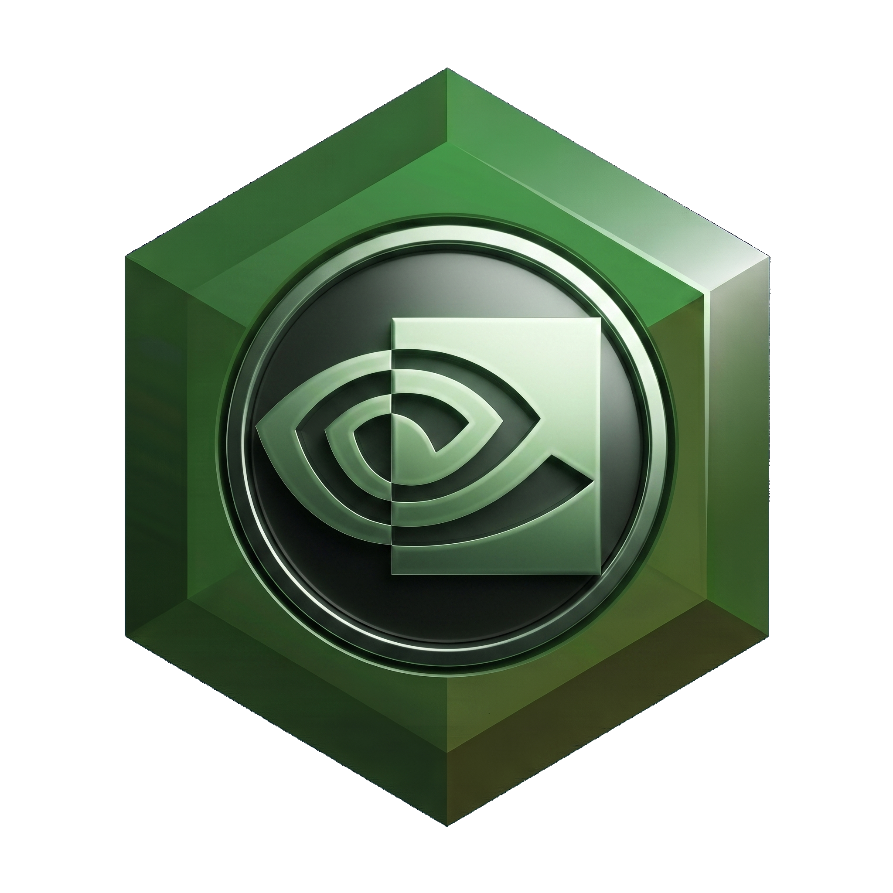
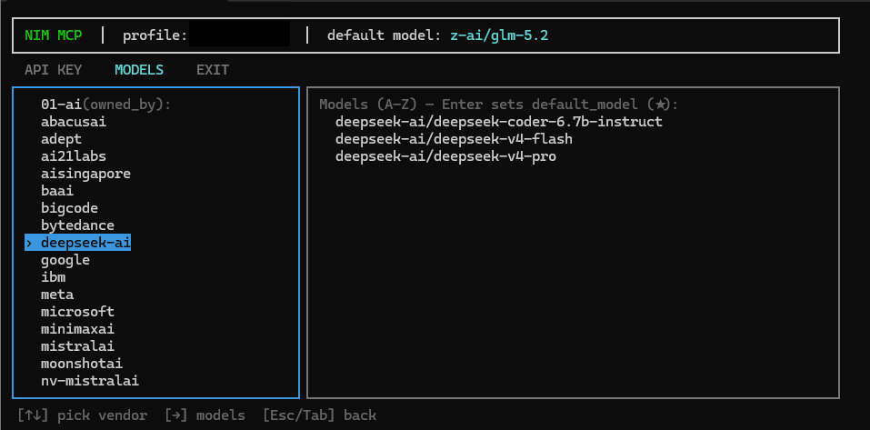

<p align="center">
  
</p>

# NIM MCP

A Model Context Protocol (MCP) server that wraps the NVIDIA NIM API (build.nvidia.com) to provide chat completions and model discovery, featuring an interactive terminal TUI for API key profile and default model management.

## Features

- **`chat_completion` Tool**: Generate chat completions using any model hosted on the NVIDIA NIM catalog. Supports standard text models, vision/VLM input (e.g., passing base64 images), custom temperatures, token limits, and function/tool calling.
- **`list_models` Tool**: Automatically fetch and list all available models through the active API key.
- **Dynamic Config Reloading**: The MCP server dynamically reloads `config.json` on every call. Switching profiles or default models via the TUI takes effect immediately, without requiring a server restart.
- **Single API Key, Full Access**: A single NVIDIA NIM API key covers the entire catalog of models. You can easily switch models by simply passing a different model string (e.g., `z-ai/glm-5.2`, `meta/llama-3.1-405b-instruct`, `qwen/qwen3-coder-480b-a35b-instruct`).
- **Interactive Terminal TUI**: A beautiful React Ink terminal interface to:
  - Create, edit, and delete multiple API key profiles.
  - View, search, and navigate available NIM models grouped by vendor.
  - Set a default model (marked with `★`) to be resolved automatically when none is specified in client requests.
- **Self-Contained Windows Setup**: Includes automated scripts to build a local environment (Python virtual environment, portable Node.js, package installs) and create a desktop shortcut.

## Prerequisites

- **OS**: Windows (setup scripts and shortcut generation are Windows-based)
- **Python**: version 3.10 or higher
- **NVIDIA NIM API Key**: A free API key from [build.nvidia.com](https://build.nvidia.com/)

## Quick Start

### 1. Setup the Environment
Double-click or execute the setup script in your terminal:
```cmd
setup.bat
```
This will automatically:
1. Create a default `config.json` configuration file.
2. Verify Python is installed and configure a local Python virtual environment (`.venv`).
3. Download a portable Node.js runtime (`.node_venv`) and install Ink dependencies for the TUI.
4. Generate a desktop shortcut called **NIM MCP**.

### 2. Configure Profiles via the TUI
Run `run.bat` (or open the **NIM MCP** desktop shortcut) to start the TUI.

1. **Configure an API Key**:
   - In the **API KEY** tab, navigate the left panel actions to select **Create API key**.
   - Type a profile name (e.g., `Default`) and press `Enter`.
   - Paste your NVIDIA NIM API key (`nvapi-...`) and press `Enter`.
   - Go to `Save` using the arrow keys and press `Enter`.
   - Select the newly created profile and choose **Switch to selected** to make it active.
2. **Select a Default Model**:
   - Navigate to the **MODELS** tab (using `Tab` or arrow keys). The TUI will fetch the live catalog from the NVIDIA endpoint.
   - Use the arrow keys to browse through vendors (left panel) and their models (right panel).
   - Press `Enter` on any model (such as `z-ai/glm-5.2`) to set it as your default model.

### 3. Register the MCP Server
Add the server configuration to your `claude_desktop_config.json` (typically located at `%APPDATA%\Claude\claude_desktop_config.json` on Windows):

```json
{
  "mcpServers": {
    "nim": {
      "command": "<path-to-NIM_MCP>\\.venv\\Scripts\\python.exe",
      "args": [
        "<path-to-NIM_MCP>\\server.py"
      ]
    }
  }
}
```

*Note: You do not need to specify `NIM_API_KEY` in the environment variables here. The server will dynamically read the active profile and API key from `config.json` at runtime.*

## TUI Preview

<p align="center">
  
</p>

## License

This project is licensed under the MIT License.
